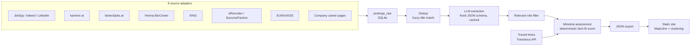

# Heimspiel

**A personal job radar for life-science and bioinformatics roles in Austria.**

[](https://github.com/NikMibu/heimspiel_jobradar/actions/workflows/ci.yml)
[](LICENSE)
[](pyproject.toml)
[](https://github.com/astral-sh/uv)

Job boards show you postings. They don't tell you which employers actually hire
people like you, how long the commute really is, or how well a role fits your
specific background. Heimspiel is a small pipeline that answers those three
questions every day: it pulls postings from nine sources, extracts them into a
structured schema with an LLM, filters and scores them against a personal
profile, and computes real public-transit commute times from your home
stations — then publishes the result as an interactive map.

It's a static site backed by a local pipeline. No server, no accounts, no
scraping proxies, no database to maintain. The whole thing costs either
nothing (local LLM via Ollama) or a few dollars a month (Claude Haiku).

## What it does



Every morning (or on demand), `heimspiel daily` runs the full chain:

1. **Fetch** — nine adapters pull new postings into SQLite. Each one fails
   independently, so a broken source never blocks the rest of the run.
2. **Dedup** — cross-source duplicates are merged by fuzzy title match within
   a 60-day window per company; the longest description wins.
3. **Extract** — Ministral Instruct turns free-text postings into an evidence-backed schema (role
   family, seniority, must/nice-to-have skills, salary, workplace mode,
   location, contract terms, original-text evidence, a two-line summary).
   Cached on content hash, schema version, and model.
4. **Locate** — free-text locations get normalized to a canonical Austrian
   city (a deterministic pass handles the obvious cases — `"Graz, Styria,
   Austria"` → `Graz` — before falling back to the LLM for ambiguous ones),
   and explicitly foreign locations are flagged rather than dropped.
5. **Score** — Ministral Reasoning classifies direct, transferable, missing,
   and unknown matches. Python computes a reproducible 0–100 fach-fit score;
   formal eligibility and practical commute/contract constraints are separate
   traffic lights instead of hidden penalties.
6. **Commute** — real public-transit travel times from up to three home
   stations to every employer site, via the [Transitous](https://transitous.org)
   open-data routing API.
7. **Export & report** — JSON for the frontend, plus a daily Markdown digest
   with the funnel (new → filtered → matches) and rejection reasons.

## Who this is for

Primarily: **me**, and anyone else job-hunting in Austrian life sciences who
wants signal instead of a firehose of postings. Clone it, drop in your own
profile (`config/profile.local.yaml`), and it becomes your radar.

It's also a reasonably complete worked example of a few patterns that show up
in a lot of small LLM-backed tools, if that's what you're here for:

- a swappable LLM backend (Anthropic API ↔ local Ollama model) behind one
  function, used identically by every pipeline stage
- deterministic filtering before any paid LLM call, so cost scales with what
  actually needs judgment, not with total volume
- content-hash caching so re-runs are idempotent and cheap
- scrapers that read and honor `robots.txt` on a per-site basis, including
  sites with unusual rules (one explicitly allows AI agents while blocking
  generic crawlers) — with the reasoning documented next to the code
- a static-site-plus-local-pipeline architecture: zero hosting cost, nothing
  to patch, nothing that can be knocked over

## Run it yourself

```bash
git clone https://github.com/NikMibu/heimspiel_jobradar && cd heimspiel_jobradar
uv sync --extra scrape
cp config/profile.example.yaml config/profile.local.yaml   # fill in your own profile
export ANTHROPIC_API_KEY=sk-ant-...
export HEIMSPIEL_LLM=anthropic
uv run heimspiel daily
```

This writes a daily digest to `data/report-<date>.md` and site data to
`site/public/data/`. Run the frontend locally with
`cd site && npm install && npm run dev`. Without your own pipeline output, the
site falls back to a demo dataset (`site/public/data/demo/`), so it's viewable
out of the box.

### Zero-cost mode: Ollama instead of the Anthropic API

Extraction and scoring use task-specific local Ministral variants:

```bash
ollama pull ministral-3:14b
ollama run hf.co/mistralai/Ministral-3-14B-Reasoning-2512-GGUF:Q4_K_M
export HEIMSPIEL_LLM=ollama
export HEIMSPIEL_EXTRACT_MODEL=ministral-3:14b
export HEIMSPIEL_SCORE_MODEL=hf.co/mistralai/Ministral-3-14B-Reasoning-2512-GGUF:Q4_K_M
export HEIMSPIEL_OLLAMA_URL=http://localhost:11434   # optional, default shown
uv run heimspiel daily
```

`HEIMSPIEL_MODEL` remains a backwards-compatible override for both tasks.
Model changes intentionally invalidate the respective cache, so results from
different extraction or ranking models are never mixed.

## Data sources

| Source | What | Notes |
|---|---|---|
| Indeed, LinkedIn | via [JobSpy](https://github.com/speedyapply/JobSpy) | Indeed runs without a time filter (the API's `hours_old` silently zeroes out niche-term results); LinkedIn is rate-limited client-side |
| [karriere.at](https://www.karriere.at) | JSON API | Austria's largest general job board |
| [biotechjobs.at](https://www.biotechjobs.at) | HTML | Life-science-specific board, also seeds the curated employer list |
| [Vienna BioCenter](https://www.viennabiocenter.org) | HTML | Campus-wide listing across all institutes and companies on site |
| [XING](https://www.xing.com) | SSR HTML + JSON-LD | `robots.txt` blocks generic crawlers on the search page but explicitly allows AI agents — see `sources/xing.py` for the reasoning behind fetching it, and how |
| eRecruiter, SuccessFactors | JSON / HTML | Per-employer ATS instances, curated in `config/ats.yaml` |
| [EURAXESS](https://euraxess.ec.europa.eu) | HTML | Academic/research postings across Austria |
| Company career pages | `trafilatura` + LLM | Weekly watch of hand-picked employer pages with no other feed; diffed against the last snapshot |

Every scraper respects `robots.txt`, rate-limits itself, and identifies with an
honest User-Agent. Where a site's rules are unusual or ambiguous, the decision
and its justification live in a comment right next to the fetch code, not
buried in a design doc.

## CLI

| Command | What it does |
|---|---|
| `heimspiel fetch` | Pull all sources into `postings_raw`, dedup |
| `heimspiel extract` | LLM extraction into the fixed schema (cached on `content_hash + schema_version`) |
| `heimspiel locations` | Resolve free-text locations to a canonical Austrian city/site |
| `heimspiel companies [--geocode]` | Sync curated employer sites; optionally propose coordinates via Nominatim |
| `heimspiel travel [--rebuild]` | Public-transit minutes, anchor × site, via Transitous |
| `heimspiel score` | Evidence assessment, deterministic fach-fit, formal/practical traffic lights |
| `heimspiel export` | Write JSON for the static site |
| `heimspiel report` | Markdown digest: funnel stats, top matches, borderline cases |
| `heimspiel daily` | The full chain above, in order |
| `heimspiel eval-roles` | Compare candidate LLMs on role classification against labeled postings |
| `heimspiel eval-extraction --labels FILE` | Compare extraction fields against hand-labeled postings |
| `heimspiel eval-ranking --labels FILE` | Compare ranking models against UI-exported personal labels |

## The frontend

A single-page MapLibre app with no backend: jobs at the same coordinates are
combined into stable location markers that remain visible at every zoom level (colored by fit score or commute
time), alongside a filterable/sortable list and a lazily loaded detail drawer
with the full extraction, score breakdown, confidence, traffic lights, and links back to the original
posting. Filters and sort persist in the URL, so a filtered view is a
shareable link; saved postings and manual role corrections persist in
`localStorage`. `Passt`/`Vielleicht`/`Nein` ranking labels are also stored
locally and export as JSONL for `eval-ranking`. Postings resolved to a location outside Austria are flagged
rather than hidden — there's a one-click toggle to hide them if you'd rather
not see them at all.

## Design decisions

- **SQLite, not a database server** — one file, one user, gitignored.
  Backups are a file copy.
- **Static site, not a backend** — the pipeline runs locally and commits
  JSON; GitHub Pages serves it. Zero hosting cost, nothing to patch, nothing
  to get hacked.
- **Fach-fit is not practicality** — senior or distant jobs retain their
  fach-fit score; formal eligibility and commute/contract practicality are
  explicit traffic lights. Only disallowed role families are not scored.
- **Anchors are train stations, not addresses** — better routing, and
  nothing personal ends up in the repo. `config/profile.local.yaml` and
  `data/` are both gitignored.
- **Versioned, model-aware caching** — extraction uses content/schema/model;
  ranking uses profile/formula/model. Partial reprocessing never mixes old
  results into the current export.

## Evaluation

`eval-roles` is the fast heuristic smoke test. `eval-extraction` measures
field accuracy and skill precision/recall against curated JSONL labels.
The UI exports personal ranking labels consumed directly by `eval-ranking`,
which reports errors, per-label means, Spearman correlation, and Precision@10/20.

## License

MIT — open source is a condition of the Transitous usage policy, and it
seemed like the right default anyway.
