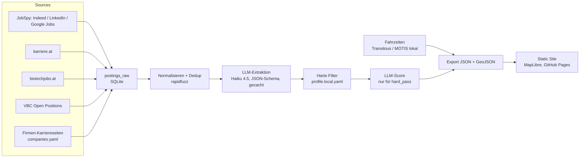

# Heimspiel

**Persönlicher Jobradar für Life-Science-Stellen in Österreich.**

Jobbörsen zeigen Inserate — ich brauchte mehr: Welche Arbeitgeber stellen Leute wie mich ein? Wie lange brauche ich mit den Öffis dorthin? Und wie gut passt die Stelle wirklich zu meinem Profil? Heimspiel sammelt täglich neue Bioinformatik-, Data-Science- und CSV/GMP-Stellen aus sechs Quellen, extrahiert sie per LLM in ein festes Schema, scort sie gegen mein Profil und rechnet die Öffi-Fahrzeit von drei Ankerbahnhöfen zu jedem Standort. Firmen mit passender Einstellungs-Historie, aber ohne aktuell passendes Inserat, werden als Initiativbewerbungs-Kandidaten ausgewiesen.

## Architektur



Static Site + lokale Pipeline. Kein Server, kein Login, keine Proxies. Einzige laufende Kosten: LLM-Extraktion (< 10 $/Monat mit Haiku 4.5).

## Run it yourself

```bash
git clone https://github.com/<you>/heimspiel && cd heimspiel
uv sync --extra scrape
cp config/profile.example.yaml config/profile.local.yaml   # ausfüllen!
export ANTHROPIC_API_KEY=sk-ant-...
uv run heimspiel daily
```

Danach liegt der Tagesreport in `data/report-<datum>.md` und die Site-Daten in `site/public/data/`. Frontend lokal: `cd site && npm install && npm run dev`. Ohne eigene Pipeline zeigt die Site den Demo-Modus (`site/public/data/demo/`).

## CLI

| Befehl | Was |
|---|---|
| `heimspiel fetch` | Alle Quellen abrufen → `postings_raw`, Dedup |
| `heimspiel extract` | LLM-Extraktion ins Schema (gecacht über `content_hash + schema_version`) |
| `heimspiel score` | Harte Filter (kostenlos) + LLM-Score nur für `hard_pass` |
| `heimspiel travel` | Öffi-Fahrzeiten Anker × Standort via Transitous (gecacht; `--rebuild` nach Fahrplanwechsel) |
| `heimspiel companies` | `companies.yaml` → DB, optional `--geocode` (Nominatim-Vorschläge) |
| `heimspiel export` | JSON für die Static Site |
| `heimspiel report` | Markdown: Top 10 neu + Initiativ-Top 5 |
| `heimspiel daily` | Alles obige in Reihenfolge (Karriereseiten sonntags) |

## Design-Entscheidungen

- **SQLite statt DB-Server:** eine Datei, ein Nutzer, `data/` ist gitignored. Backups = Datei kopieren.
- **Static Site statt Backend:** die Pipeline läuft lokal und pusht JSON; GitHub Pages serviert. Null Hosting-Kosten, nichts zu warten, nichts zu hacken.
- **Harte Filter vor LLM:** PhD-Pflicht, Seniorität, Rollenfamilie und Fahrzeit sind deterministisch und kostenlos. Nur die ~20 % Überlebenden kosten einen LLM-Score-Call.
- **Anker = Bahnhöfe, nicht Adressen:** besseres Routing, nichts Privates im Repo. `profile.local.yaml` und `data/` sind gitignored.
- **Extraktions-Cache über `content_hash + schema_version`:** ein Inserat wird genau einmal extrahiert; Backfills > 500 laufen über die Batch-API (halber Preis).

## Null-Kosten-Variante: Ollama statt Haiku

Extraktion und Score laufen wahlweise über ein lokales Modell (Ollama, Structured
Outputs via JSON-Schema — kein Proxy nötig):

```bash
ollama pull qwen2.5:7b
export HEIMSPIEL_LLM=ollama              # Backend umschalten
export HEIMSPIEL_MODEL=qwen2.5:7b        # optional, das ist der Default bei ollama
export HEIMSPIEL_OLLAMA_URL=http://localhost:11434   # optional, Default
uv run heimspiel daily
```

Der Extraktions-Cache ist backend-unabhängig — bereits extrahierte Inserate werden
nicht neu bezahlt/gerechnet. Die Batch-API greift nur beim Anthropic-Backend.

## Eval

`docs/EVAL.md` — Feld-Accuracy der Extraktion auf 50 handgelabelten Inseraten (geplant: Haiku vs. lokales Modell via Ollama, umschaltbar über `HEIMSPIEL_LLM`/`HEIMSPIEL_MODEL`).

## Lizenz

MIT — Open Source ist Bedingung der Transitous-Usage-Policy.
