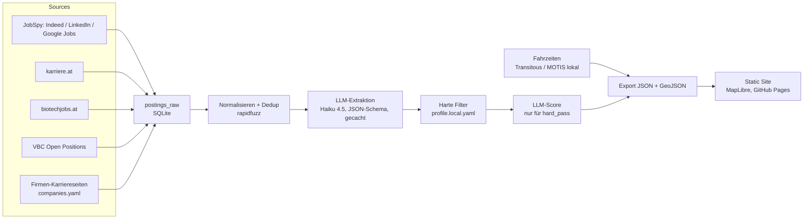

# Heimspiel — persönlicher Jobradar (Spec v0.1)

> Ziel: In rund zehn Abenden ein Tool, das mir täglich neue Life-Science-/Bioinformatik-/CSV-Stellen in meinem Öffi-Radius zeigt, gegen mein Profil scort und Firmen für Initiativbewerbungen liefert. Danach: herzeigbares GitHub-Projekt.
> Prinzip: Static Site + lokale Pipeline. Kein Server, kein Login, keine Proxies. Einzige laufende Kosten: LLM-Extraktion.

---

## 1. Ziele und Nicht-Ziele

**Ziele (v0.1)**
- Täglich neue Inserate aus: Indeed, LinkedIn, Google Jobs (alle via JobSpy), karriere.at, biotechjobs.at, VBC Open Positions, ~50–150 Firmen-Karriereseiten
- LLM-Extraktion in ein festes Schema, Dedup über Quellen
- Matching gegen mein Profil: harte Filter + LLM-Score mit Begründung, Lücken und Bewerbungs-Angle
- Öffi-Fahrzeit von drei Ankern zu jedem Standort, Isochronen-Karte, Filter
- Initiativ-Kandidaten: Firmen mit passender Einstellungs-Historie, aber ohne aktuell passendes Inserat
- Kosten < 10 $/Monat, Hosting 0 €

**Nicht-Ziele (v0.1)**
- Multi-User, Accounts, Datenbank-Server, Mobile-App
- Bewerbungsunterlagen erzeugen (macht das Bewerbungs-Plugin; Heimspiel liefert nur den Angle)
- Proxies/Anti-Blocking-Infrastruktur (Volumen ist klein genug)
- XING-Adapter (v0.2, nur wenn Google Jobs Lücken zeigt)

---

## 2. Architektur



Pipeline läuft lokal (`uv run heimspiel daily`), schreibt `site/public/data/*.json`, pusht → Pages deployt. Kein Backend.

---

## 3. Quellen-Adapter

| Quelle | Methode | Frequenz | Notizen |
|---|---|---|---|
| Indeed, LinkedIn, Google Jobs | `python-jobspy` (`scrape_jobs(site_name=["indeed","linkedin","google"], country_indeed="Austria", hours_old=24, results_wanted=100, description_format="markdown", linkedin_fetch_description=True)`) | täglich | Indeed ist stabil, LinkedIn limitiert nach wenigen hundert Ergebnissen pro IP → max. 6 LinkedIn-Queries/Tag, 15 s Pause. Google Jobs braucht exakte Suchsyntax (`google_search_term`), deckt karriere.at/StepStone/XING teilweise mit ab |
| karriere.at | `curl_cffi`/requests auf `/jobs/{keyword}/{ort}?page=n`, Detailseiten folgen; 1 Request / 2 s; Fallback Playwright | täglich | Nur Keywords aus `search.yaml`; wenn geblockt: auf Google-Jobs-Abdeckung zurückfallen |
| biotechjobs.at | `search.php`, server-gerendertes HTML → BeautifulSoup | täglich | Arbeitgeber-Verzeichnis der Seite zusätzlich als Seed für `companies.yaml` einlesen |
| VBC | `https://www.viennabiocenter.org/career/open-positions/` → Liste parsen, Links folgen | täglich | Eine Seite, alle Campus-Institute und -Firmen |
| Firmen-Karriereseiten | `companies.yaml` → fetch → `trafilatura` Text → LLM: "liste offene Positionen (title, url, location)" → Diff zum letzten Snapshot | wöchentlich (So) | Playwright nur bei JS-only-Seiten. Diff liefert `new` / `closed` → Basis für Einstellungs-Historie |

**`config/search.yaml`** (Start; DE/EN mischen)
```yaml
terms:
  - Bioinformatik
  - Bioinformatics
  - Computational Biology
  - Data Scientist Life Science
  - Computer System Validation
  - CSV Validierung GMP
  - Qualifizierung Validierung
  - Data Steward
  - Downstream Processing
  - Protein Purification
  - HPLC Analytik
  - Massenspektrometrie
  - Cheminformatics
  - Scientific Programmer
  - LIMS
locations: [Wien, Niederösterreich, Linz, Wels, Salzburg, Innsbruck, Kundl]
```

---

## 4. Datenmodell (SQLite, eine Datei `data/heimspiel.db`)

```sql
companies(id, name, website, career_url, seed_source, notes)
sites(id, company_id, label, lat, lon, address_text, is_hq, geocode_source)
anchors(id, label, lat, lon)
postings_raw(id, source, source_id, url, first_seen, last_seen, raw_title, raw_company, raw_location, raw_text, content_hash)
postings(id, raw_id, company_id, site_id, extracted_json, model, extracted_at)
scores(posting_id, profile_version, hard_pass, hard_reasons, fit_score, fit_reasons, gaps, angle, model, scored_at)
travel_times(site_id, anchor_id, minutes, transfers, engine, computed_at)
career_snapshots(company_id, fetched_at, positions_json, diff_new, diff_closed)
```

Dedup: `content_hash` über (normalisierter Titel, Firma, Ort) + `rapidfuzz.token_set_ratio ≥ 92` gegen Postings derselben Firma der letzten 60 Tage. Gewinner = Quelle mit längstem Text.

---

## 5. Extraktionsschema (Haiku 4.5, Structured Output / Tool Use)

```json
{
  "title_norm": "string",
  "role_family": "bioinformatics | data_science | csv_qa_validation | lab_analytics | downstream_process | mass_spec | data_steward | scientific_software | other",
  "seniority": "entry | junior | mid | senior",
  "education_min": "none | bsc | msc | phd",
  "phd_required": "bool",
  "years_experience_min": "int | null",
  "must_skills": ["string"],
  "nice_skills": ["string"],
  "domain_keywords": ["string"],
  "german_required": "bool",
  "salary_min_eur_month": "number | null",
  "salary_basis": "monthly_14x | yearly | null",
  "location_text": "string",
  "workplace_mode": "onsite | hybrid | remote | unknown",
  "travel_share_pct": "int | null",
  "start_text": "string | null",
  "contract_type": "permanent | fixed_term | internship | unknown",
  "contract_end": "date | null",
  "application_deadline": "date | null",
  "summary_2_lines": "string"
}
```

Regeln für den Prompt: Gehalt nur übernehmen, wenn im Text eine Zahl steht (österreichische Inserate müssen das Mindestgehalt nennen). `phd_required = true` nur bei explizitem "PhD/Doktorat erforderlich", nicht bei "von Vorteil". Nichts erfinden, `null` ist erlaubt. Cache-Key = `content_hash + schema_version`.

Modell: `claude-haiku-4-5-20251001`. System-Prompt mit Prompt-Caching. Für einen Backfill (> 500 Inserate) Batch-API nutzen (halber Preis).

---

## 6. Profil und Matching

**`config/profile.local.yaml`** (gitignored; Quelle: `00_basis/fakten.md` aus dem Bewerbungs-Plugin, daraus generieren)

```yaml
profile_version: 1
earliest_start: 2026-10-01
education: msc_fh_bioinformatics
phd_wanted: false
role_families_allowed: [bioinformatics, data_science, csv_qa_validation, lab_analytics, downstream_process, mass_spec, data_steward, scientific_software]
seniority_allowed: [entry, junior, mid]
interests: [AI/ML-Validierung im GMP-Umfeld, Massenspektrometrie lernen, Data Science + Medizin, Scientific Programming mit AI-Agent-Stack, HPC/lokale AI]
skills: {...}          # aus fakten.md
hard_no: [Vertrieb, Callcenter, reine Softwaretests ohne Life-Science-Bezug]
anchors:
  - {id: home,   label: "<Heimbahnhof NÖ>",        max_minutes: 75}
  - {id: wien,   label: "Wien Hauptbahnhof",       max_minutes: 60}
  - {id: family, label: "Vöcklabruck Bahnhof",     max_minutes: 90}
travel_policy: any_anchor   # Standort ok, wenn EIN Anker im Limit ist
```

**Harte Filter (kein LLM, kostenlos)**
1. `phd_required` → raus
2. `seniority == senior` oder `years_experience_min > 3` → raus
3. `role_family` nicht in `role_families_allowed` → raus
4. Kein Anker im Fahrzeit-Limit → raus (Standort unbekannt → durchlassen, markieren)
5. `contract_end` < 12 Monate → markieren, nicht raus

**LLM-Score (nur `hard_pass == true`)**
Rubrik 0–100: Skill-Fit (Anteil der must_skills, die das Profil belegt), Interessen-Fit (Bezug zu `interests`), Realismus (Ausbildung, Erfahrungsjahre). Output: `fit_score`, `fit_reasons` (3 Bullets), `gaps` (max. 3), `angle` (ein Satz: "so würde ich mich hier positionieren"). Der `angle` ist der Übergabepunkt an `motivationsschreiben`.

**Initiativ-Score (pro Firma, kein LLM)**
`relevant_postings_12m × 1.0 + relevant_postings_24m × 0.5 − aktuell offene passende Inserate`, nur Firmen mit Standort im Fahrzeit-Limit. Ausgabe: "hat in 18 Monaten 4× Downstream/Analytik gesucht, aktuell nichts offen → Initiativbewerbung". Historie wächst mit jedem Tag Laufzeit; Seed aus 24 Monaten JobSpy-Suche pro Firmenname, wo möglich.

---

## 7. Fahrzeiten und Isochronen

**Anker:** Heimbahnhof (NÖ), Wien Hbf, Bahnhof Vöcklabruck (Raum Lenzing). Anker als Bahnhöfe, nicht Adressen: besseres Routing, nichts Privates im Repo.

**Engine v0 — Transitous (public MOTIS-API):** `GET /api/v1/plan?fromPlace=lat,lon&toPlace=lat,lon&time=<Dienstag 07:00>` je Anker × Standort. Bei 3 Ankern × 200 Standorten ≈ 600 Calls einmalig, danach nur neue Standorte. Bedingungen der Transitous-Usage-Policy: Projekt ist Open Source, Last klein halten, Ergebnisse cachen, für schwere Abfragen (Isochronen) vorher fragen oder lokal rechnen.

**Engine v1 — MOTIS lokal (für Isochronen):**
1. `austria-latest.osm.pbf` (Geofabrik) + GTFS-Feeds von mobilitaetsdaten.gv.at (Mobilitätsverbünde Österreich, pro Datenlieferant) und ÖBB-GTFS (CC BY 4.0)
2. MOTIS-Docker-Image, `config.yml` mit OSM + GTFS-Zips → `motis import` → `motis server`
3. Pro Anker: Transit-Erreichbarkeit aller Haltestellen (`one-to-all` bzw. `one-to-many`, je nach MOTIS-Version, OpenAPI prüfen) → Minuten je Haltestelle
4. H3-Hexgrid über Österreich (res 6, ≈ 2.300 Zellen): Zellzeit = min(Haltestellenzeit + Fußweg bei 5 km/h) → GeoJSON je Anker mit Klassen 45/60/90/120 min
5. Frontend färbt Hexes → das ist die Isochronen-Karte. Neu rechnen bei Fahrplanwechsel (Dezember)

Optional Auto: OpenRouteService-Isochronen (Free-API-Key), falls Auto je relevant wird.

---

## 8. Frontend (GitHub Pages)

- Vite + TypeScript + MapLibre GL JS, Tiles von OpenFreeMap (kostenlos), kein Backend
- Daten: `data/jobs.json`, `data/companies.json`, `data/isochrones/<anchor>.geojson`, `data/meta.json` (Laufzeit, Zählungen)
- Layout: Karte links (Standorte farbig nach Score oder Fahrzeit, Hex-Layer pro Anker umschaltbar), Liste rechts, Detail-Drawer (Extraktion, Score-Begründung, Lücken, Angle, Links zu allen Quellen)
- Filter: Rollenfamilie, Score ≥, max. Minuten je Anker, Quelle, `first_seen` ≤ N Tage, Vertragsart, Toggle "Initiativ-Kandidaten"
- Zustand in URL-Parametern (teilbar), Merkliste in `localStorage`
- Demo-Modus: `data/demo/` mit anonymisiertem Beispielprofil, damit Besucher die Seite ohne Pipeline sehen

---

## 9. Scheduling

- Lokal: `uv run heimspiel daily` um 06:30 via cron oder Cowork Scheduled Task → `git commit data/ && git push` → Pages-Workflow deployt
- Optional GitHub Actions nightly für die unkritischen Quellen (biotechjobs, VBC, Karriereseiten, Indeed); LinkedIn bleibt lokal (GitHub-IPs werden schneller geblockt)
- `heimspiel report` → Markdown-Tagesreport (Top 10 neu, Initiativ-Top 5) → direkt in den Obsidian-Vault

---

## 10. Repo-Struktur

```
heimspiel/
├─ pyproject.toml            # uv, python ≥ 3.12
├─ src/heimspiel/
│  ├─ cli.py                 # typer: fetch | extract | score | travel | export | daily | report
│  ├─ db.py                  # sqlite schema + migrations
│  ├─ sources/               # jobspy_src.py, karriere_at.py, biotechjobs.py, vbc.py, career_pages.py
│  ├─ normalize.py           # dedup, company matching
│  ├─ extract.py             # LLM-Schema, Cache
│  ├─ match.py               # harte Filter, LLM-Score, Initiativ-Score
│  ├─ travel/                # transitous.py, motis_local.py, isochrones.py (h3)
│  └─ export.py              # JSON/GeoJSON → site/public/data
├─ config/                   # search.yaml, companies.yaml, profile.example.yaml
├─ site/                     # Vite + MapLibre
├─ docs/                     # SPEC.md, EVAL.md
├─ tests/                    # Adapter-Tests mit gespeicherten HTML-Fixtures
└─ .github/workflows/        # ci.yml (ruff, pytest), pages.yml
```

`companies.yaml`-Eintrag:
```yaml
- name: Beispiel Biotech GmbH
  website: https://example.at
  career_url: https://example.at/karriere
  seed_source: biotechjobs_directory
  sites:
    - {label: "Werk Kundl", lat: 47.46, lon: 11.99, is_hq: false}
    - {label: "Wien Zentrale", lat: 48.21, lon: 16.37, is_hq: true}
```
Werk ≠ Firmensitz ist der häufigste Fehler in Inseraten → Standorte hier händisch pflegen, Geocoding (Nominatim, 1 Req/s, gecacht) nur als Vorschlag.

---

## 11. Meilensteine (je ~ 1 Abend = 3 h)

| # | Ergebnis | Abende |
|---|---|---|
| M1 | Repo, uv, SQLite, JobSpy + biotechjobs + VBC Adapter, `heimspiel fetch` → CSV der heutigen Inserate | 2 |
| M2 | Extraktion + harte Filter + Score, `heimspiel report` → Markdown-Top-10. **Ab hier täglich nutzbar** | 2 |
| M3 | `companies.yaml` (Seed: eigene Zielliste + biotechjobs.at-Verzeichnis + LISAvienna/Biotech-Austria/Business-Upper-Austria-Listen), Geocoding, Transitous-Matrix, Karriereseiten-Watcher, Initiativ-Score | 2 |
| M4 | Static Site: Karte, Liste, Filter, Detail, Initiativ-Toggle, Pages-Deploy | 2 |
| M5 | MOTIS lokal, Hex-Isochronen, Layer im Frontend | 1–2 |
| M6 | Portfolio: README, Diagramm, GIF, Eval, Tests, CI, Demo-Daten | 1–2 |

---

## 12. Kosten

| Posten | Kosten |
|---|---|
| Scraping (JobSpy, requests, Playwright) | 0 € |
| Transitous / MOTIS lokal / GTFS / OSM | 0 € |
| GitHub Pages, Actions, OpenFreeMap-Tiles | 0 € |
| Haiku 4.5 Extraktion: ~40–60 relevante Inserate/Tag × ~2.500 Token ≈ 0,003 $/Inserat | ~3–6 $/Monat |
| Haiku 4.5 Score: nur hard_pass (~20 %) | ~1–2 $/Monat |
| **Gesamt** | **< 10 $/Monat** |

Null-Kosten-Variante: Extraktion über Ollama (z. B. Qwen 2.5 7B) mit `instructor`/LiteLLM als Switch, Qualität mit dem Eval-Set vergleichen. Das ist zugleich ein Portfolio-Punkt (lokale AI).

---

## 13. Risiken und Gegenmaßnahmen

- **LinkedIn 429:** wenige Queries, `hours_old=24`, keine Proxies; Indeed und Google Jobs tragen die Breite
- **karriere.at blockt:** Playwright, notfalls nur Google-Jobs-Abdeckung
- **Standort = Firmensitz statt Werk:** `sites` händisch in `companies.yaml`, Eval prüft Standortfeld gesondert
- **LLM erfindet Gehalt/PhD-Pflicht:** Eval-Set (50 handgelabelte Inserate), Feld-Accuracy im README, Prompt-Regeln aus §5
- **Transitous-Policy:** sparsam, cachen, Isochronen lokal
- **GTFS-Wechsel im Dezember:** `heimspiel travel --rebuild`
- **Portfolio vs. Privatsphäre:** `profile.local.yaml` und `data/heimspiel.db` gitignored, Anker = Bahnhöfe, Demo-Profil fiktiv

---

## 14. README-Checkliste (Portfolio)

- [ ] Problem in 5 Sätzen: Jobbörsen zeigen Inserate, ich brauchte Arbeitgeber + Erreichbarkeit + Profil-Fit
- [ ] Architektur-Diagramm (Mermaid aus §2)
- [ ] 20-Sekunden-GIF der Karte mit Isochronen und Filter
- [ ] Eval-Tabelle: Extraktion pro Feld (Precision/Recall auf 50 Inseraten), Haiku vs. lokales Modell
- [ ] "Run it yourself" in 5 Befehlen mit Demo-Profil
- [ ] Design-Entscheidungen: warum SQLite, warum Static Site, warum harte Filter vor LLM
- [ ] Lizenz MIT (Transitous-Bedingung: Open Source)
